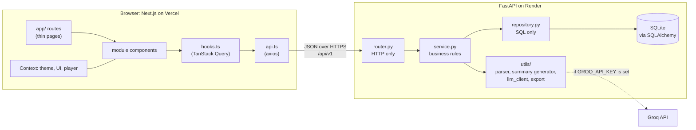
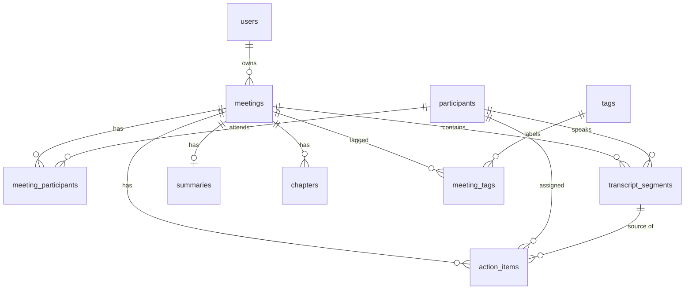

# Fireflies.ai Clone

A functional clone of the [Fireflies.ai](https://fireflies.ai) meeting-assistant web app, built as the
Scaler AI Labs SDE Fullstack assignment. Browse a meetings library, open a meeting to read an interactive
transcript synced to a media player, view AI summaries / action items / chapters, and create, edit and
delete meetings and action items.

| | |
|---|---|
| **Live app** | https://fireflies-clone-live.vercel.app/ |
| **Live API** | https://fireflies-clone-backend-g98e.onrender.com/docs |

> The first request to the API after an idle period can be slow (free-tier cold start). See
> [Deployment notes](#deployment-notes).

## Contents

1. [Feature checklist](#feature-checklist)
2. [Tech stack](#tech-stack)
3. [Architecture](#architecture)
4. [Database schema](#database-schema)
5. [API overview](#api-overview)
6. [Setup](#setup)
7. [Deployment notes](#deployment-notes)
8. [Assumptions and limitations](#assumptions-and-limitations)
9. [Built with AI assistance](#built-with-ai-assistance)

---

## Feature checklist

### Core

- [x] Meetings library: cards with title, date, duration, participant avatars, summary preview
- [x] Search by title (debounced), filter by participant and date range, sort, pagination (state kept in the URL)
- [x] Meeting detail: header, participants, actions menu (Rename, Edit, Export, Delete with confirmation)
- [x] Media player bar: play/pause, seek bar, time, ±15 s, speed control; simulated clock when a meeting has no media
- [x] Interactive transcript: speaker blocks with timestamps, active-line highlight, auto-scroll, click-to-seek
- [x] In-transcript search: highlights all matches, "n of m", previous/next
- [x] AI summary: overview, keyword chips, bullet points; regenerate and edit by hand
- [x] Action items: add, edit, complete (optimistic), delete, "jump to" the moment in the transcript
- [x] Outline / chapters: click a chapter to seek
- [x] Create a meeting: upload `.txt` / `.vtt` / `.json`, paste a transcript, or fill in a form
- [x] Edit and delete meetings; edit transcript segments (API)
- [x] Loading (skeleton), empty and error states on every data view
- [x] Seeded demo data (4 meetings with transcripts, summaries, chapters and action items)
- [x] Deep link `?t=<ms>` seeks the player on load

### Bonus

- [x] Export a meeting as TXT or Markdown
- [x] "Ask about this meeting" (LLM, with transcript citations); needs `GROQ_API_KEY`
- [x] Home dashboard: recent meetings, open action items across meetings, workspace-wide AskFred
- [x] Cross-meeting "Tasks" page (`GET /action-items`)
- [x] Dark mode (default) with a theme setting (System / Light / Dark)
- [x] Request IDs, access logging, `/health` and `/health/db`, deploy smoke test (`scripts/smoke.py`)
- [ ] Global full-text search (SQLite FTS5): `GET /search` is specified in `docs/api.md` but **not implemented**;
      the navbar search box is a visual placeholder
- [ ] Tags: tables exist and the list endpoint accepts `tag_id`, but there is no endpoint or UI to create or
      assign tags
- [ ] Out of scope, shown as "Coming soon": live meeting bot, real speech-to-text, integrations, team sharing,
      real authentication, billing

---

## Tech stack

| Layer | Choice |
|---|---|
| Frontend | Next.js 16 (App Router), React 19, TypeScript (strict), Tailwind CSS v4 |
| Frontend data / forms | TanStack Query, React Context (theme, UI, player), react-hook-form + zod |
| Frontend UI | shadcn/ui (Radix primitives), lucide-react, react-hot-toast |
| HTTP client | axios (single instance, normalised `ApiError`) |
| Frontend tests / lint | Vitest, ESLint, Prettier |
| Backend | Python 3.12 (3.11+ supported), FastAPI, Pydantic v2, pydantic-settings |
| ORM / migrations | SQLAlchemy 2.0 (typed `Mapped[]`), Alembic |
| Database | SQLite (`PRAGMA foreign_keys=ON` on every connection, WAL mode) |
| LLM (optional) | Groq via the `groq` SDK, model `openai/gpt-oss-20b`; deterministic mock when no key is set |
| Backend tests / lint | pytest + FastAPI TestClient, Ruff, Black |
| Hosting | Render (backend), Vercel (frontend) |

---

## Architecture



### Backend: router → service → repository

Each feature is a module under `backend/app/modules/<module>/` with the same five files.

| Layer | Does | Does not |
|---|---|---|
| `router.py` | Parses the request (Pydantic validates), calls **one** service function, returns a response model | Query the DB or hold business logic |
| `service.py` | Business rules, orchestration, raises `AppException` subclasses (`NotFoundError`, `ValidationError`, …) | Import FastAPI or build SQL |
| `repository.py` | SQLAlchemy queries, small functions named for intent (`get_owned`, `list_filtered`) | Make business decisions |
| `schemas.py` | `XCreate`, `XUpdate` (PATCH, all optional), `XRead`, `XListItem` | |
| `models.py` | SQLAlchemy 2.0 typed models | |

Cross-module calls go service → service, never router → another module's repository. Modules:
`meetings`, `participants`, `transcripts`, `summaries`, `action_items`, `exports`, `ask`, `users`.
`core/` holds config, database, exceptions (one global handler returning
`{"error": {"code", "message", "details"}}`), health and logging. `utils/` holds the transcript parser,
the mock and LLM summary generators behind one interface, the Groq client and the export formatter.

### Frontend: modules → hooks → api

```
src/
├── app/        routing only: thin pages that compose module components
├── modules/    meetings, transcript, player, summary, action-items, home, settings, ...
│   └── <module>/  api.ts (raw typed HTTP, no React) → hooks.ts (TanStack Query) → components/
└── shared/     layout (sidebar, navbar), ui primitives, context, constants (query keys, routes), utils
```

Components never call axios: components call hooks, hooks call `api.ts`. Server state lives in TanStack Query
(mutations toast and invalidate; action-item toggles are optimistic); UI state lives in small Contexts. The
`PlayerProvider` owns playback (`currentTimeMs`, `seek`, `play`, `pause`) behind one engine interface with two
implementations: a real `<audio>`/`<video>` element and a `requestAnimationFrame` clock used when a meeting has no
media. The transcript reads time from an external store and re-renders only when the active line changes.

The reasoning behind each non-obvious choice is logged in [docs/decisions.md](docs/decisions.md).

---

## Database schema

Full column-level detail, indexes and constraints: [docs/schema.md](docs/schema.md).



| Table | Purpose |
|---|---|
| `users` | Owner of meetings; one seeded default user (id=1), no password column |
| `meetings` | Title, `meeting_date`, `duration_ms`, optional `media_url`, `source`, `platform` |
| `participants` / `meeting_participants` | People and the many-to-many link, with a `host` / `attendee` role |
| `transcript_segments` | One utterance: `speaker_label`, optional `participant_id`, `start_ms`, `end_ms`, `text`, `position` |
| `summaries` | 1:1 with a meeting: overview, JSON `bullet_points` and `keywords`, `generated_by` (`seed` / `mock` / `llm`) |
| `chapters` | Outline entries with a `start_ms` to seek to |
| `action_items` | Text, assignee, due date, completion state, optional source segment |
| `tags` / `meeting_tags` | Tag tables (no endpoints yet) |

### Key design decisions

- **Integer milliseconds** for all in-meeting time: exact, sortable, no float rounding, maps to
  `HTMLMediaElement.currentTime * 1000`.
- **`speaker_label` plus a nullable `participant_id`**: raw transcripts only carry labels, so mapping to people is
  optional and survives deleting a participant.
- **CASCADE vs SET NULL**: owned children (segments, summary, chapters, action items) die with the meeting;
  references to people (assignee, speaker) are nulled instead.
- **Summary is a separate 1:1 table** (UNIQUE FK) so regeneration never touches the meeting row and the list query
  stays light. Keywords and bullets are JSON because they are always read and written as a whole.
- **`position` columns** give explicit ordering independent of timestamps.
- **Every foreign key is indexed** (SQLite does not do it automatically); composite indexes such as
  `(owner_id, meeting_date)` and `(meeting_id, start_ms)` serve the list and transcript queries.
- **Enums are TEXT with named CHECK constraints** (SQLite has no enum type); Python side uses `StrEnum`.
- **UTC datetimes** via a custom column type that rejects naive datetimes, so timezone bugs fail loudly.
- **Migrations through Alembic** (batch mode for SQLite); a test runs `alembic check` so a model change without a
  migration fails CI.
- **Portable**: moving to PostgreSQL is mostly a `DATABASE_URL` change (not tested here).

---

## API overview

Base path `/api/v1`. JSON in snake_case. Lists return `{ items, total, page, limit }`; every error returns
`{ "error": { "code", "message", "details" } }`. Full request/response shapes and error codes:
[docs/api.md](docs/api.md). Interactive Swagger UI: `/docs` (local: <http://localhost:8000/docs>,
live: `LIVE_API_URL/docs`).

| Group | Endpoints |
|---|---|
| Health (no prefix) | `GET /health` · `GET /health/db` |
| Current user | `GET /me` |
| Meetings | `GET /meetings` (q, participant_id, date_from, date_to, sort, page, limit) · `POST /meetings` · `POST /meetings/upload` · `GET /meetings/{id}` · `PATCH /meetings/{id}` · `DELETE /meetings/{id}` |
| Transcript | `GET /meetings/{id}/transcript` · `PATCH /transcript-segments/{id}` |
| Summary | `POST /meetings/{id}/summary/generate` · `PATCH /meetings/{id}/summary` |
| Action items | `GET /meetings/{id}/action-items` · `POST /meetings/{id}/action-items` · `PATCH /action-items/{id}` · `DELETE /action-items/{id}` · `GET /action-items` (across meetings) |
| Participants | `GET /participants?q=` |
| Export | `GET /meetings/{id}/export?format=txt\|md` |
| Ask (needs `GROQ_API_KEY`) | `POST /meetings/{id}/ask` · `POST /ask` |

`GET /search` appears in `docs/api.md` as a planned bonus endpoint; it is not implemented.

Conventions: `GET` read, `POST` create (201), `PATCH` partial update (200), `DELETE` (204, no body). Uploads accept
`.txt` / `.vtt` / `.json` up to 2 MB.

---

## Setup

**Prerequisites:** Python 3.11+ (3.12 recommended), Node.js 20+ and npm, Git.

### Backend

**Windows (PowerShell)**

```powershell
cd backend
python -m venv .venv
.venv\Scripts\Activate.ps1          # if blocked: Set-ExecutionPolicy -Scope Process Bypass
pip install -r requirements-dev.txt
Copy-Item .env.example .env
alembic upgrade head                # create the schema
python -m app.seed.seed             # idempotent: only seeds an empty database
uvicorn app.main:app --reload       # http://localhost:8000/docs
```

**macOS / Linux**

```bash
cd backend
python3 -m venv .venv
source .venv/bin/activate
pip install -r requirements-dev.txt
cp .env.example .env
alembic upgrade head
python -m app.seed.seed
uvicorn app.main:app --reload       # http://localhost:8000/docs
```

`requirements.txt` is runtime only (what the host installs); `requirements-dev.txt` adds pytest, httpx, Ruff and
Black. With `SEED_ON_STARTUP=true` (the default in `.env.example`) the app also seeds itself on boot when the
database has no meetings, so the explicit seed step is optional.

**`backend/.env`**

| Variable | Required | Notes |
|---|---|---|
| `DATABASE_URL` | yes | `sqlite:///./fireflies.db` locally |
| `CORS_ORIGINS` | yes | JSON list, e.g. `["http://localhost:3000"]` |
| `ENV` | no | `development` / `test` / `production` (production hides error details in 500s) |
| `LOG_LEVEL` | no | default `INFO` |
| `SEED_ON_STARTUP` | no | `true` seeds an empty DB on boot |
| `CORS_ORIGIN_REGEX` | no | e.g. Vercel preview URLs |
| `GROQ_API_KEY` | no | enables LLM summaries and "Ask"; empty = mock summaries, Ask returns 503 |
| `LLM_MODEL` | no | default `openai/gpt-oss-20b` |

**Backend checks**

```bash
cd backend
pytest -q
ruff check . && black --check .
```

### Frontend

**Windows (PowerShell)**

```powershell
cd frontend
npm install
Copy-Item .env.example .env.local
npm run dev                         # http://localhost:3000
```

**macOS / Linux**

```bash
cd frontend
npm install
cp .env.example .env.local
npm run dev                         # http://localhost:3000
```

**`frontend/.env.local`**

| Variable | Notes |
|---|---|
| `NEXT_PUBLIC_API_URL` | Backend base URL **including `/api/v1`**, no trailing slash. Default `http://localhost:8000/api/v1`. Inlined at build time; a production build fails if it is missing. |

**Frontend checks**

```bash
cd frontend
npm run lint
npm run test        # Vitest: pure logic (player search, URL state, time formatting, ...)
npm run build
```

Run the backend first so the frontend has data to show.

---

## Deployment notes

Backend on **Render**, frontend on **Vercel**. Step-by-step instructions and troubleshooting:
[docs/deployment.md](docs/deployment.md). Blueprint: [render.yaml](render.yaml).

1. **Render** (Blueprint or manual web service, root directory `backend`): build `pip install -r requirements.txt`,
   start `sh scripts/start.sh` (runs `alembic upgrade head`, then uvicorn on `$PORT`), health check `/health`.
2. **Vercel** (root directory `frontend`): set `NEXT_PUBLIC_API_URL=LIVE_API_URL/api/v1` **before** the first build.
3. **Back on Render:** set `CORS_ORIGINS=["LIVE_FRONTEND_URL"]` (exact origin, JSON list) and redeploy.
4. **Smoke test:** `python scripts/smoke.py LIVE_API_URL` checks health, seed data, and a create/read/delete round trip.

| Where | Variable | Value |
|---|---|---|
| Render | `ENV` | `production` |
| Render | `DATABASE_URL` | `sqlite:///./fireflies.db` (ephemeral) or `sqlite:////var/data/fireflies.db` with a disk |
| Render | `CORS_ORIGINS` | `["LIVE_FRONTEND_URL"]` |
| Render | `SEED_ON_STARTUP` | `true` |
| Render | `PYTHON_VERSION` | `3.12` |
| Render | `GROQ_API_KEY`, `LLM_MODEL`, `CORS_ORIGIN_REGEX` | optional |
| Vercel | `NEXT_PUBLIC_API_URL` | `LIVE_API_URL/api/v1` |

**SQLite persistence caveat.** The database is one SQLite file. On a host with an ephemeral filesystem it is
discarded when the service is rebuilt or moved, so meetings, edits and uploads created by users disappear. By
default the app re-seeds the demo meetings whenever the database is empty, so it is never blank, but user changes
are lost. To keep data, attach a persistent disk (see the commented `disk:` block in `render.yaml`) and point
`DATABASE_URL` at it; disks are only available on some plans and limit the service to one instance.

**Cold start.** Free-tier services may be stopped when idle. The first request afterwards can take a while (boot,
migrations, possibly seeding), and the frontend may briefly show its loading or error state; refresh and it works.

---

## Assumptions and limitations

- **Transcription is mocked.** There is no speech-to-text. Transcripts are seeded or uploaded (`.txt`, `.vtt`,
  `.json`) or pasted; uploaded audio/video is not processed.
- **Summaries** are seeded, produced by a deterministic mock (keyword frequency, time-window chapters, regex action
  items), or by Groq when `GROQ_API_KEY` is set. "Ask" works only with a key (otherwise `503 LLM_NOT_CONFIGURED`).
- **Default user, no real auth.** `get_current_user()` returns the seeded user (id=1). Every owner-scoped query
  already filters by it, so real auth is a one-function swap. Another user's data would return 404, never 403.
- **Media is a placeholder.** Meetings without a `media_url` use a simulated playback clock with a working seek bar.
- **Placeholders ("Coming soon"):** integrations, analytics, team/workspace, AI Skills, soundbites, discussion,
  bookmarks, voice agents, upgrade/billing. Notifications are client-side mock data.
- **Not implemented:** global full-text search (the navbar search box does nothing yet) and tag management.
- **Light theme is not tuned.** The UI was matched to the dark reference screenshots and dark is the default; the light
  palette is a best guess and may look off in places.
- **Data persistence** on the free deployment is ephemeral (see above).
- **Single-instance SQLite:** fine for a demo, not for concurrent multi-instance production use.
- Transcript search is client-side (the whole transcript is already loaded); uploads are limited to 2 MB.
- Frontend tests cover pure logic only (Vitest, no component tests).

---

## Built with AI assistance

This project was built with [Claude Code](https://claude.com/claude-code). The architecture rules, API contract,
schema and build plan were written down first (`CLAUDE.md`, `docs/`), and the code was produced in vertical slices
(model → schema → repository → service → router → test → frontend) against them, with checks run after each slice.
The design choices and trade-offs are logged in [docs/decisions.md](docs/decisions.md) and were reviewed by me so I can
explain them.
