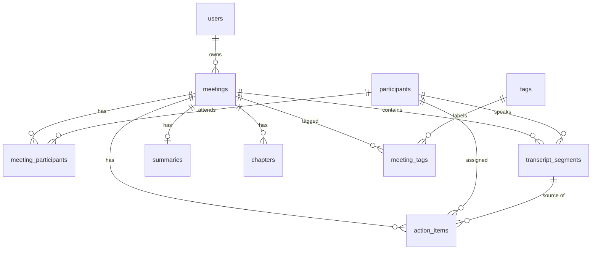

# Database Schema (SQLite)

Design goals: normalized core entities, explicit relationships, cascade deletes for owned children,
integer milliseconds for in-meeting time, indexes on every foreign key and on the columns used for
filtering/sorting.

## ER diagram

## Tables

### users
| column | type | notes |
|---|---|---|
| id | INTEGER PK | |
| name | TEXT NOT NULL | |
| email | TEXT NOT NULL UNIQUE | |
| avatar_url | TEXT NULL | |
| created_at | DATETIME NOT NULL | default now (UTC) |

One default user is seeded (id=1). There is no password column: auth is out of scope.

### meetings
| column | type | notes |
|---|---|---|
| id | INTEGER PK | |
| owner_id | INTEGER NOT NULL FK → users.id ON DELETE CASCADE | indexed (leading column of `ix_meetings_owner_date`) |
| title | TEXT NOT NULL | 1–200 chars |
| meeting_date | DATETIME NOT NULL | when the meeting happened (UTC); indexed for sort/filter |
| duration_ms | INTEGER NOT NULL DEFAULT 0 | derived from last segment end if not given |
| media_url | TEXT NULL | sample audio file or NULL → simulated player |
| source | TEXT NOT NULL | enum: `seed`, `upload`, `paste`, `form` |
| platform | TEXT NULL | display only: `zoom`, `google_meet`, `teams`, `upload` |
| created_at / updated_at | DATETIME NOT NULL | |

Indexes: `ix_meetings_owner_date (owner_id, meeting_date)`, `ix_meetings_title`.
(ASC on purpose: SQLite scans the index backwards for `ORDER BY meeting_date DESC` at no extra cost,
and a DESC index can't be reflected by Alembic autogenerate.)

### participants
| column | type | notes |
|---|---|---|
| id | INTEGER PK | |
| name | TEXT NOT NULL | |
| email | TEXT NULL UNIQUE | NULL allowed for speakers known only by name |
| avatar_color | TEXT NULL | for initials avatar |
| created_at | DATETIME NOT NULL | |

A person appears in many meetings → many-to-many through `meeting_participants`.

### meeting_participants (join table)
| column | type | notes |
|---|---|---|
| meeting_id | INTEGER FK → meetings.id ON DELETE CASCADE | |
| participant_id | INTEGER FK → participants.id ON DELETE CASCADE | indexed (filter by participant) |
| role | TEXT NOT NULL DEFAULT 'attendee' | `host`, `attendee` |

PK `(meeting_id, participant_id)`.

### transcript_segments
| column | type | notes |
|---|---|---|
| id | INTEGER PK | |
| meeting_id | INTEGER NOT NULL FK → meetings.id ON DELETE CASCADE | |
| participant_id | INTEGER NULL FK → participants.id ON DELETE SET NULL | resolved speaker |
| speaker_label | TEXT NOT NULL | raw label from the file ("Speaker 1", "Priya") — kept even if participant is deleted |
| start_ms | INTEGER NOT NULL | CHECK start_ms >= 0 |
| end_ms | INTEGER NOT NULL | CHECK end_ms >= start_ms |
| text | TEXT NOT NULL | |
| position | INTEGER NOT NULL | 0-based order within meeting |
| created_at | DATETIME NOT NULL | |

Indexes: `UNIQUE (meeting_id, position)`, `ix_segments_meeting_start (meeting_id, start_ms)`,
`ix_transcript_segments_participant_id`.

### summaries (1:1 with meetings)
| column | type | notes |
|---|---|---|
| id | INTEGER PK | |
| meeting_id | INTEGER NOT NULL UNIQUE FK → meetings.id ON DELETE CASCADE | UNIQUE enforces 1:1 |
| overview | TEXT NOT NULL | paragraph summary |
| bullet_points | JSON NOT NULL DEFAULT '[]' | "shorthand notes" bullets |
| keywords | JSON NOT NULL DEFAULT '[]' | key topics shown as chips |
| generated_by | TEXT NOT NULL | enum: `seed`, `mock`, `llm` |
| created_at / updated_at | DATETIME NOT NULL | |

JSON is used for ordered, display-only lists that are always read/written as a whole with the summary;
they are never queried individually, so a separate table would add joins with no benefit.

### chapters (outline)
| column | type | notes |
|---|---|---|
| id | INTEGER PK | |
| meeting_id | INTEGER NOT NULL FK → meetings.id ON DELETE CASCADE | |
| title | TEXT NOT NULL | |
| start_ms | INTEGER NOT NULL | click → seek |
| position | INTEGER NOT NULL | |
| created_at | DATETIME NOT NULL | |

Index: `UNIQUE (meeting_id, position)`.

### action_items
| column | type | notes |
|---|---|---|
| id | INTEGER PK | |
| meeting_id | INTEGER NOT NULL FK → meetings.id ON DELETE CASCADE | indexed |
| text | TEXT NOT NULL | 1–500 chars |
| assignee_id | INTEGER NULL FK → participants.id ON DELETE SET NULL | indexed |
| due_date | DATE NULL | |
| is_completed | BOOLEAN NOT NULL DEFAULT 0 | |
| completed_at | DATETIME NULL | set by service when toggled |
| source_segment_id | INTEGER NULL FK → transcript_segments.id ON DELETE SET NULL | indexed; "jump to where this was said" |
| position | INTEGER NOT NULL | display order |
| created_at / updated_at | DATETIME NOT NULL | |

### tags / meeting_tags (bonus)
`tags(id, name UNIQUE, color, created_at)`; `meeting_tags(meeting_id FK CASCADE, tag_id FK CASCADE indexed, PK(meeting_id, tag_id))`.

### segments_fts (bonus: global search)
SQLite FTS5 virtual table: `CREATE VIRTUAL TABLE segments_fts USING fts5(text, content='transcript_segments', content_rowid='id');`
kept in sync with triggers (created in its own hand-written Alembic migration in the global-search
slice; autogenerate can't see virtual tables). Enables fast ranked full-text search
across all meetings with `snippet()` for highlighted previews.

## Design decisions (for the interview)

- **Milliseconds as INTEGER**: exact, sortable, no float rounding; VTT/JSON both convert cleanly.
- **speaker_label + nullable participant_id**: raw transcripts only have labels; mapping labels to
  people is optional and survives participant deletion.
- **position columns**: explicit ordering independent of timestamps (overlapping speech, edits).
- **CASCADE vs SET NULL**: owned children (segments, summary, chapters, action items) die with the
  meeting; references to people (assignee, speaker) are nulled, never cascading data loss.
- **Summary is 1:1 via UNIQUE FK**, separate from meetings so regeneration doesn't touch meeting rows
  and the meetings list query stays light.
- **Enums** (`source`, `platform`, `role`, `generated_by`) are TEXT with a named CHECK constraint
  (`ck_<table>_<enum>`), since SQLite has no enum type.
- **Every FK is indexed** (SQLite doesn't do it automatically); a composite index whose leading column
  is the FK counts.
- **SQLite specifics**: `PRAGMA foreign_keys=ON` per connection (off by default); WAL mode for better
  concurrent reads. Moving to PostgreSQL only requires changing `DATABASE_URL` (JSON → JSONB).
